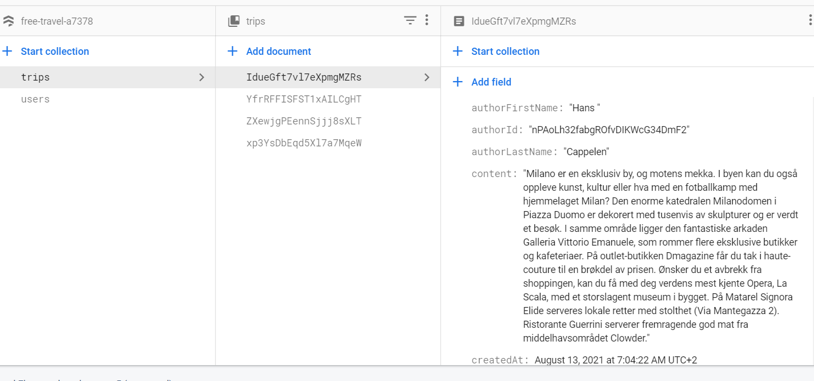
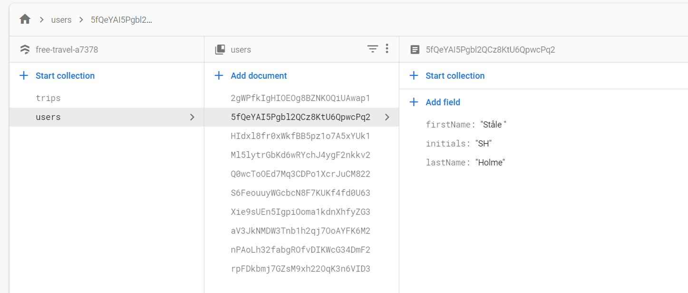

# <h1 align="center"> Free-travel</h1> 

<p align="center"> Webutvikling og API-design (PG6301)</p>


### Dependencies: 
- "express": "^4.17.1",
- "firebase": "^8.2.2",
- "moment": "^2.29.1",
- "react": "^17.0.2",
- "react-dom": "^17.0.2",
- "react-redux": "^5.1.1",
- "react-redux-firebase": "^2.2.4",
- "react-router-dom": "^5.2.0",
- "react-scripts": "^4.0.3",
- "redux": "^4.1.1",
- "redux-firestore": "^0.5.7",
- "redux-thunk": "^2.3.0"


### Løsnigen

Jeg hadde en ide om å lage en nettside/forumside for reise byrå. Her kunne ansette logge seg inn og legge til reisetips til sine kunder.
Kunder kan besøke siden og se på tipsene, men de har ikke noe mulighet til å endre eller slette innlegg. Det kun noe ansatte kan gjøre. 

### Teknologi


NodeJS version:
```
"engines":{
     "node":"12.0.0"
}
```


build/run:
```
"scripts": {
    "start": "concurrently npm:parcel npm:express",
    "parcel": "parcel watch src/public/index.html",
    "express": "nodemon --watch src/server src/server/server.js",
    "test": "echo \"Error: no test specified\" && exit 1"
  },´
```

**I Denne oppgaven har jeg valgt og bruke npm**

Jeg har brukt firebase som min backend. Det er en effektiv plattform som er enkelt og bruke med React og JavaScript. Har har jeg opprettet en database som inneholder to tabeller,
users og trips. Her så er vært innlegg tilknuttet en bruker. 

*Trips-Table*


*Users-Table*



For og fetch-e dataen fra firebase database så bruker jeg react-redux, react-redux-firebase, redux, redux-firestore. Firebase har masse innebygde funksjoner som gjør det lett og fetch-e dataen fra databasen uten og måte trenger å bruke ajax eller axios. 
[Mer om redux og firebase](http://react-redux-firebase.com/)


Bruker autentiseringen er custom Email/Password provider. Det er på samme måte som å få kontakt med firebase databasen, så er autentiseringen enkelt og implementere i kode.  

<p align="center">
  <b>Folder Structured:</b><br>
  <a href="#">src/client</a> |
  <a href="#">src/server</a> |
  <a href="#">src/public</a>
  <br><br>
  
</p>

##<h2 align="center">  Funksjoner i web applikasjonen</h2>

### <h3 align="center">  Funksjoner jeg rakk og bli ferdig med:</h3>
- [x] Bruker kan logge inn.
- [x] Bruker kan legge til nye Reisetips til databasen.
- [x] Bruker kan se hva han/ hun har postet og det andre har posted.
- [x] Brukeren kan se inn holdet men må logge inn for å legge til ett nytt innlegg

### <h3 align="center">Funksjoner jeg ville implimentere:</h3><br/>
- [ ] Bruker kan slette sitte innhold.
- [ ] Bruker kan updatere sin blogg.
- [ ] Chat funksjon.


## <h1 align="center"> Start the program</h1>

For å kunne kjøre programmet må du ha en Config.js fil ( den følger med i zip-filen).
Plan var og kjøre .env-fil men det dukket opp flere problemer derfor velger jeg å bruke kun Config.js filen.

### Config.js
Legg til Config.js under ***src/server***
```
import firebase from 'firebase/app';
import 'firebase/firestore';
import 'firebase/auth';

var Config = {
    apiKey: "API_KEY",
  authDomain: "PROJECT_ID.firebaseapp.com",
  databaseURL: "https://PROJECT_ID.firebaseio.com",
  projectId: "PROJECT_ID",
  storageBucket: "PROJECT_ID.appspot.com",
  messagingSenderId: "SENDER_ID",
  appId: "APP_ID",
  measurementId: "G-MEASUREMENT_ID",
};
        // Initialize Firebase
firebase.initializeApp(Config);
firebase.firestore().settings({ timestampInSnapshots: true});

export default firebase;
```


1. `npm install`
2. `npm start`

Programmet skal startet på http://localhost:8080/


# <h1 align="center"> Punkter som har påvirket eksamen </h1>

Det startet med at oppgaven ble ikke lastet opp til wiseflow.

Jeg hadde fått en annen beskjed på hva som var lov og bruke i den eksamen i forhold til den forrige eksamen.
Jeg fikk beskjed om at vi kunne bruke npm og create-react-app. Og med det så har jeg øvd på den måten. 

Jeg fikk svar kl 08:00 12/08. Da har det gått såpass langtid at jeg følte jeg mistet en hel dag.
Med det så har det påvirket tiden jeg har til både å jobbe med koden og dokumentasjoen. 


